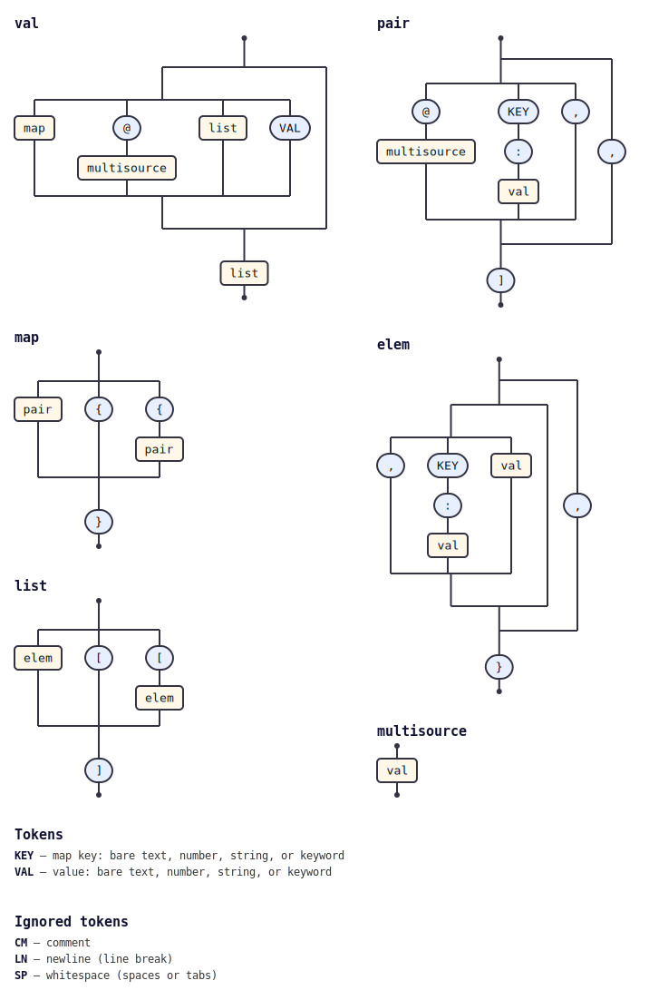

# @tabnas/multisource

A Jsonic / tabnas plugin that merges multiple sources into a single parse
result. A marked path (`@a.jsonic`) is resolved, parsed, and spliced in place —
so one document can compose many.

This repository contains:

| Path | Description |
|---|---|
| [`ts/`](ts/) | TypeScript / JavaScript implementation (canonical). |
| [`go/`](go/) | Go port (tracks the TS version). |

## Tiny example

```js
import { Tabnas } from '@tabnas/parser'
import { jsonic } from '@tabnas/jsonic'
import { MultiSource } from '@tabnas/multisource'
import { makeMemResolver } from '@tabnas/multisource/resolver/mem'

const j = new Tabnas().use(jsonic).use(MultiSource, {
  resolver: makeMemResolver({ 'foo.jsonic': 'a:1' }),
})

j.parse('@"foo.jsonic" b:2')   // => { a: 1, b: 2 }
```

## Documentation

Four-quadrant [Diátaxis](https://diataxis.fr) docs per language:

| | TypeScript | Go |
|---|---|---|
| Tutorial (learning) | [`ts/doc/tutorial.md`](ts/doc/tutorial.md) | [`go/doc/tutorial.md`](go/doc/tutorial.md) |
| How-to (tasks) | [`ts/doc/guide.md`](ts/doc/guide.md) | [`go/doc/guide.md`](go/doc/guide.md) |
| Reference (information) | [`ts/doc/reference.md`](ts/doc/reference.md) | [`go/doc/reference.md`](go/doc/reference.md) |
| Concepts (understanding) | [`ts/doc/concepts.md`](ts/doc/concepts.md) | [`go/doc/concepts.md`](go/doc/concepts.md) |

See also [`ts/README.md`](ts/README.md) and [`go/README.md`](go/README.md).

## Grammar diagram

The grammar as a railroad/syntax diagram, generated from the live grammar
with [`@tabnas/railroad`](https://github.com/tabnas/railroad):



ASCII version: [`ts/doc/grammar.txt`](ts/doc/grammar.txt).

## License

MIT. Copyright (c) Richard Rodger.
