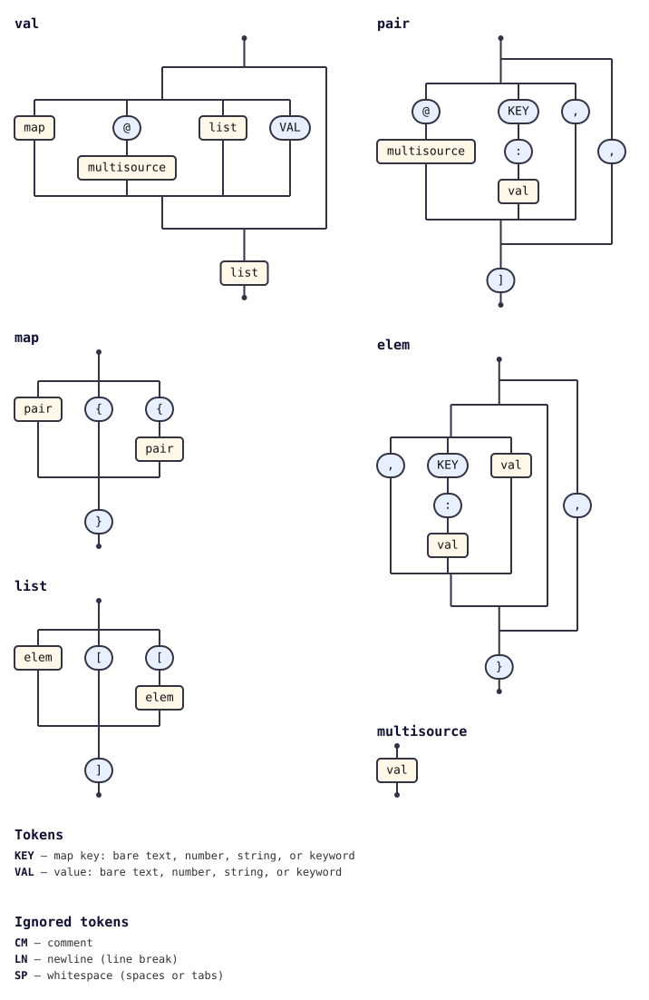

# multisource (Go)

The Go port of [`@tabnas/multisource`](../ts/). Merges multiple sources into a
single jsonic parse result: a marked path (`@a.jsonic`) is resolved, parsed,
and spliced in place. The TypeScript implementation is canonical; this package
tracks it.

Package identifier: `tabnasmultisource`.


## Install

```sh
go get github.com/tabnas/multisource/go
```


## Tiny example

The package is a plugin. You build the host parser yourself, here a jsonic
parser, and install `MultiSource` on it:

```go
import (
    jsonic "github.com/tabnas/jsonic/go"
    tabnasmultisource "github.com/tabnas/multisource/go"
)

files := map[string]string{"foo.jsonic": "{a:1}"}
j := jsonic.Make()
j.Use(tabnasmultisource.MultiSource, map[string]any{
    "resolver": tabnasmultisource.MakeMemResolver(files),
})
out, _ := j.Parse(`@foo.jsonic b:2`)
// out == map[string]any{"a": float64(1), "b": float64(2)}
```

The package ships no processor for `.json` sources, so the value of one is
its raw text. To parse it, register your own processor for the `json` kind, as
the [how-to guide](doc/guide.md#load-json-sources) shows.


## Documentation

Four-quadrant [Diátaxis](https://diataxis.fr) docs:

- [Tutorial](doc/tutorial.md). Zero to a working multisource parse.
- [How-to guide](doc/guide.md). Recipes: custom kinds, merging, base paths,
  custom resolvers.
- [Reference](doc/reference.md). Every exported symbol, option, and type.
- [Concepts](doc/concepts.md). How it works, and how the Go port differs from
  the TypeScript version.


## Differences from the TypeScript implementation

The TypeScript package is canonical and the Go port tracks it, with one
deliberate gap: **`.js` sources are not supported in Go**. In TypeScript,
`makeJavaScriptProcessor` loads a `.js` reference by executing the JavaScript
module (`require(...)`) and splicing in its exports; Go has no JavaScript
runtime, so this cannot be ported. A `@foo.js` reference in Go falls through to
the default raw-string processor, and `.js` is not among the default implicit
extensions. (`.jsc` files are jsonic content, not JavaScript, and are fully
supported.) Use `.jsonic`/`.jsc` sources, `.json` sources with a processor you
register for the `json` kind, or a custom `Processor` if you embed your own
interpreter.

The full list of behavioural and idiom differences is in
[Concepts: differences from the TypeScript implementation](doc/concepts.md#differences-from-the-typescript-implementation).


## Grammar diagram

The grammar as a railroad/syntax diagram (shared with the TS implementation):



A vertical ASCII version is in [`../ts/doc/grammar.txt`](../ts/doc/grammar.txt).

## License

MIT © Richard Rodger and contributors.
